# 高性能编程


## 矩阵的存储方式

本课程主要使用C语言、数据的处理使用的是Matlab。在C语言中矩阵大多是按照二维数组进行存储的，但是在高性能编程中，矩阵是用一维数组进行存储的，并利用映射进行元素对应。矩阵中的元素通常按照列进行存储保存在一维数组中（列主序）；如果是行主序，那么矩阵中的元素按照行进行存储保存在一维数组中。

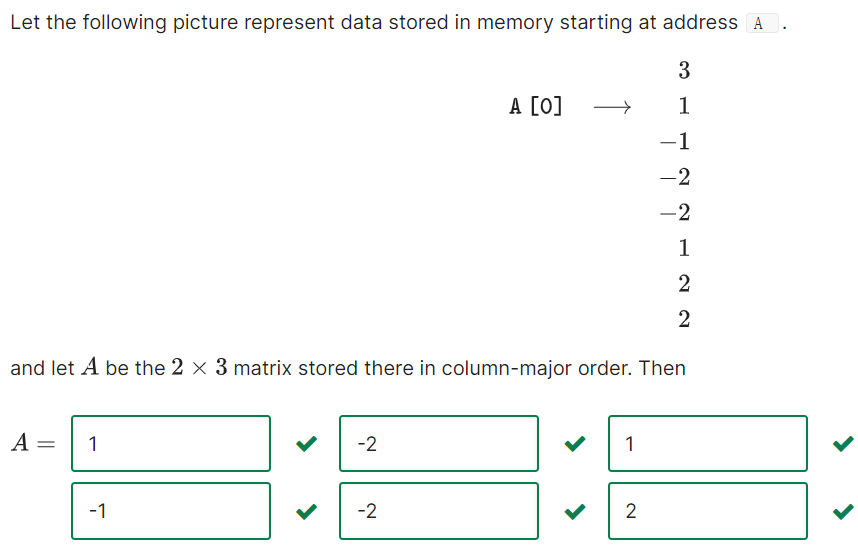

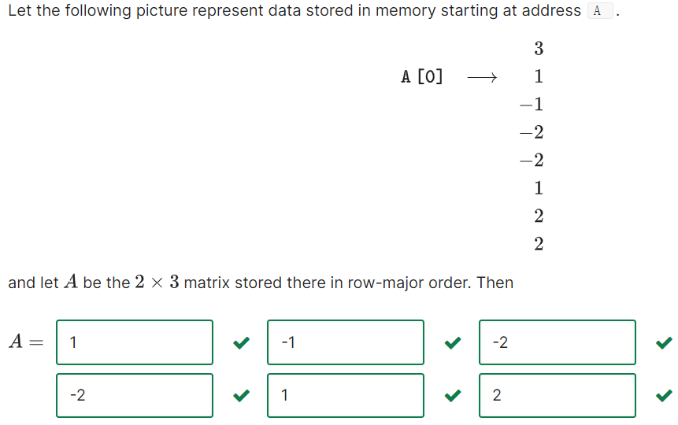

高性能编程中通常遇见的矩阵为子矩阵，此时子矩阵的大小就不能反应其在内存中的存储情况。要想搞清楚子矩阵在内存中的存储情况则必须要知道其母矩阵的大小也就是The leading dimension。下图就说明了这个问题。

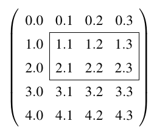

框住的子矩阵的大小是$2\times 3$的，其母矩阵为$5\times 4$，所以框起来的子矩阵The leading dimension为$5$。不难看出要想读取子矩阵的行向量则需要每隔$5$个元素读取一次，所以$5$也是子矩阵行向量的间隔步长。

通常利用宏定义来转化为我们熟悉的方式访问矩阵中的元素。例如矩阵$A$、向量$x$的元素可以通过如下进行访问：

```c
#define alpha( i,j ) A[ (j)*ldA + i ]   // map alpha( i,j ) to array A
#define chi( i )  x[ (i)*incx ]         // map chi( i )  to array x
```

其中`ldA`为矩阵$A$的The leading dimension，`incx`为向量$x$间隔步长。


## 常用的向量运算

### 向量内积

内积运算定义为：

$$
\gamma:=x^T y+\gamma = \sum_{i=0}^{n-1}\chi_i\psi_i+\gamma
$$
上面的表达式代表了在数值$\gamma$的基础上加上向量$x$与向量$y$的内积，并将得到的数值更新原有数值$\gamma$。下面为内积运算的C语言代码：

```c
#define chi( i ) x[ (i)*incx ]   // map chi( i ) to array x 
#define psi( i ) y[ (i)*incy ]   // map psi( i ) to array y

void Dots( int n, double *x, int incx, double *y, int incy, double *gamma )
/*
n is length of vector x and y
x and y are address of vector x and y
incx and incy are incresment number of vector x and y
gamma is adress of value which need to be updated
*/
{
  for ( int i=0; i<n; i++ )
    *gamma += chi( i ) * psi( i );
}
```

### axpy运算

axpy运算定义为，其中$\alpha$为放缩因子：

$$
y:=\alpha x+y
$$
上面的表达式代表了在向量$y$的基础上加上向量$x$的$\alpha$倍，并将得到的向量更新原有的向量$y$。上面表达式代表有如下关系：

$$
\psi_i:=\alpha \chi_i+\psi_i,i=0,\cdots,n-1​
$$
下面为axpy运算的C语言代码：

```c
#define chi( i ) x[ (i)*incx ]   // map chi( i ) to array x 
#define psi( i ) y[ (i)*incy ]   // map psi( i ) to array y 

void Axpy( int n, double alpha, double *x, int incx, double *y, int incy ) 
/*
n is length of vector x and y
x and y are address of vector x and y which need to be updated
incx and incy are incresment number of vector x and y
alpha is scalar
*/
{
  for ( int i=0; i<n; i++ ) 
    psi(i) += chi(i) * psi(i);
}
```


## 子矩阵相乘实现方法

这一节我们需要计算的等式为$C:=AB+C$，其中$C$为$m\times n$的子矩阵；A为$m\times k$的子矩阵；B为$k\times n$的子矩阵。也就是在子矩阵$C$的基础上加上子矩阵$A$与子矩阵$B$的乘积，并将得到的子矩阵更新原有的子矩阵$C$。我们约定如下的符号使用$i,j,p$分别为$C$的行列下标与$A$的列下标（$B$的行下标），$\alpha,\beta,\gamma$分别为$A,B,C$的元素，$a,b,c$分别为$A,B,C$的列向量，$\widetilde a^T,\widetilde b^T,\widetilde c^T$分别为$A,B,C$的行向量，$x,y$向量的元素为$\chi,\psi$。

### 对于循环排序的初步探讨

对于$C:=AB+C$子矩阵运算法则为：

$$
\gamma_{i, j}:=\sum_{p=0}^{k-1}\alpha_{i, p} \beta_{p, j}+\gamma_{i, j}
$$
我们可以看见目前有三个下标需要循环，可能的循环组合为6种（$IJP$、$IPJ$、$PJI$、$PIJ$、$JIP$、$JPI$），那么那一种是效率较高的呢。考虑到矩阵是按照列进行存储的，那么也许利用这个性质就能找到效率最高的循环方法。下图是这六种排序方法的结果，可以看见$PJI$与$JPI$是效率最高的两种排序。GFLOPS为每秒钟进行几倍于十亿次运算。

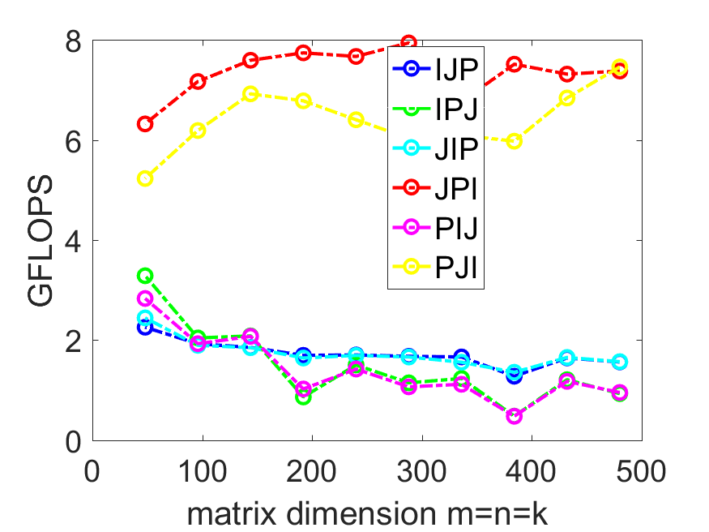

为什么是$PJI$与$JPI$效率较高呢？不难发现，其最后一个指标为$I$，这也就意味着$I$是最内层的循环。注意到$I$为子矩阵$A$的行下标，意味着在固定前两层的运算中$A$的列数是不变的，只是改变行号。这使得内存的读取是顺序的（与矩阵存储机制有关），其余的排序方法是乱序的需要不断的跳跃进行读取$A$的元素。同样的，在固定第一层的运算中$C$的列数是不变的，只是改变行号。所以对于子矩阵$C$读取也是连续的，其余排序方法是乱序读取。上面讲述的内容可以简化为下图，对于子矩阵$A$与$C$元素的读取都是固定列进行的，这使得内存读取更加的连续。那又是为什么$JPI$的效率高于$PJI$呢？这是因为$J$是否在最外层循环。每次执行$PJI$排序的内循环写入不同列的$C$ ，而$JPI$是写入相同列的$C$。

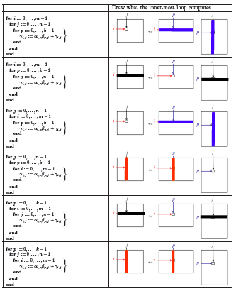

其实子矩阵与子矩阵之间的算法都是基于上面那六种排序，接下来我们将更详细的解释如何理解这六种方法。不同的子矩阵分块的选择就会导致不同的循环序号，而不同的循环序号就会产生不同的计算效率。


### $J$为最外层序号

#### 子矩阵分块方法

$J$为最外层序号这意味着子矩阵的分块方法如下所示：

$$
C=\begin{equation}
\left(\begin{array}{ccc}
c_{0} & \cdots & c_{n-1}
\end{array}\right):=\left(\begin{array}{lll}
A b_{0}+c_{0} & \cdots & A b_{n-1}+c_{n-1}
\end{array}\right)
\end{equation}
$$
也就是首先将子矩阵$C$与$B$的列进行分裂，那么就有如下的关系：
$$
c_{j}:=A b_{j}+c_{j},j=0,\cdots,n-1
$$
通过上面的表达式包含了矩阵向量乘积，我们将矩阵向量乘积定义为函数

```c
void MyGemv( int m, int n, double *A, int ldA, double *x, int incx, double *y, int incy )
```

其中子矩阵$A$有`m`行`k`列，其起始地址为`A`，The leading dimension为`ldA`，需要乘的向量起始地址为`&beta( 0, j )`间隔步长为`1`，需要更新的向量起始地址为`&gamma( 0,j )`间隔步长为`1`。那么就有如下的代码实现上面的等式：

```c
#define alpha( i,j ) A[ (j)*ldA + i ]   // map alpha( i,j ) to array A 
#define beta( i,j )  B[ (j)*ldB + i ]   // map beta( i,j )  to array B
#define gamma( i,j ) C[ (j)*ldC + i ]   // map gamma( i,j ) to array C

void MyGemv( int, int, double *, int, double *, int, double *, int );

void MyGemm( int m, int n, int k,
	     double *A, int ldA,
	     double *B, int ldB,
	     double *C, int ldC )
{
  for ( int j=0; j<n; j++ )
    MyGemv( m, k, A, ldA, &beta( 0, j ), 1, &gamma( 0,j ), 1 );
}
  
```

#### 矩阵向量积分块方法

上文中最为复杂的内容是如何处理矩阵向量积，接下来就是两种处理的方法。

第一种处理的方法为将子矩阵$A$与向量$c_j$进行行分裂：

$$
c_{j}:=\left(\begin{array}{c}
\gamma_{0,j} \\
\gamma_{1,j} \\
\vdots \\
\gamma_{m-1,j}
\end{array}\right)=A b_{j}+c_{j}=\begin{equation}
\left(\begin{array}{c}
\tilde{a}_{0}^{T} \\
\tilde{a}_{1}^{T} \\
\vdots \\
\tilde{a}_{m-1}^{T}
\end{array}\right) b_j+\left(\begin{array}{c}
\gamma_{0,j} \\
\gamma_{1,j} \\
\vdots \\
\gamma_{m-1,j}
\end{array}\right)
\end{equation}=
\left(\begin{array}{c}
\tilde{a}_{0}^{T} b_j+\gamma_{0,j} \\
\tilde{a}_{1}^{T} b_j+\gamma_{1,j} \\
\vdots \\
\tilde{a}_{m-1}^{T} b_j+\gamma_{m-1,j}
\end{array}\right)
,j=0,\cdots,n-1
$$
上面的表达式等价于：
$$
\gamma_{i,j}=\tilde{a}_{i}^{T} b_j+\gamma_{i,j},i=0,\cdots,m-1,\ \text{and}\ j=0,\cdots,n-1
$$
这样就可以转化为向量内积进行运算。下面的代码是**基于内积运算的矩阵向量积**（代码中符号对应的矩阵向量积符号为$y:=Ax+y$）：

```c
#define alpha( i,j ) A[ (j)*ldA + i ]   // map alpha( i,j ) to array A 
#define chi( i )  x[ (i)*incx ]         // map chi( i )  to array x
#define psi( i )  y[ (i)*incy ]         // map psi( i )  to array y

void Dots( int, const double *, int, const double *, int, double * );

void MyGemv( int m, int n, double *A, int ldA,
           double *x, int incx, double *y, int incy )
/*
m,n is size of Matrix A
ldA is the leading dimension of Matrix A
x and y are address of vector x and y which need to be updated
incx and incy are incresment number of vector x and y
*/
{
  for ( int i=0; i<m; i++ )
    Dots( n, &alpha( i,0 ), ldA, x, incx , &psi( i ) );
}
```

第二种方法是将子矩阵$A$列分裂与向量$b_j$行分裂：

$$
c_j=\begin{equation}
\left(\begin{array}{cccc}
a_{0} & a_{1} & \cdots & a_{k-1}
\end{array}\right)\left(\begin{array}{c}
\beta_{0,j} \\
\beta_{1,j} \\
\vdots \\
\beta_{k-1,j}
\end{array}\right)+c_j
\end{equation}=
\beta_{0} a_{0}+\beta_{1} a_{1}+\cdots+\beta_{k-1} a_{k-1}+c_j=\sum_{p=0}^{k-1}\beta_{p} a_{p}+c_j
$$
于是这样就可以转化为axpy运算进行处理。下面的代码是**基于axpy运算的矩阵向量积**（代码中符号对应的矩阵向量积符号为$y:=Ax+y$）：

```c
#define alpha( i,j ) A[ (j)*ldA + i ]   // map alpha( i,j ) to array A 
#define chi( i )  x[ (i)*incx ]         // map chi( i )  to array x
#define psi( i )  y[ (i)*incy ]         // map psi( i )  to array y

void Axpy( int, double, double *, int, double *, int );

void MyGemv( int m, int n, double *A, int ldA,
           double *x, int incx, double *y, int incy )
/*
m,n is size of Matrix A
ldA is the leading dimension of Matrix A
x and y are address of vector x and y which need to be updated
incx and incy are incresment number of vector x and y
*/
{
  for ( int j=0; j<n; j++ )
    Axpy( m, chi(j), &alpha(0,j), 1, y, incy);
}
```

#### 循环排序总结

$J$为最外层序号主要利用的是子矩阵$C$与$B$的列进行分裂，然后需要计算子矩阵$A$与向量$b_j$的向量积。矩阵向量积可以通过分裂子矩阵$A$的行变成向量内积，或者分裂子矩阵$A$的列与向量$b_j$变成axpy运算。通过上文不难发现循环排序与方法选用的对应关系为：$J$为最外层序号+向量内积=$JIP$，$J$为最外层序号+axpy运算=$JPI$。


### $P$为最外层序号

#### 子矩阵分块方法

$P$为最外层序号这意味着的子分块方法如下所示：

$$
\begin{equation}
C:=\left(\begin{array}{llll}
a_{0} & a_{1} & \cdots & a_{k-1}
\end{array}\right)\left(\begin{array}{c}
\tilde{b}_{0}^{T} \\
\tilde{b}_{1}^{T} \\
\vdots \\
\tilde{b}_{k-1}^{T}
\end{array}\right)+C
\end{equation}=
a_{0} \tilde{b}_{0}^{T}+a_{1} \tilde{b}_{1}^{T}+\cdots+a_{k-1} \tilde{b}_{k-1}^{T}+C=\sum_{p=0}^{k-1}a_{0} \tilde{b}_{0}^{T}+C
$$
也就是将子矩阵$A$的列与$B$的行进行分裂。我们定义$C:=a_p\tilde{b}_{p}^{T}+C$为秩一更新，并且定义为函数

```c
void MyGer( int m, int n, double *x, int incx, double *y, int incy, double *A, int ldA )
```

其中`m,n`为子矩阵$C$的行数与列数，`x`为第一个行向量的起始地址目前为`&alpha( 0,p )`，`incx`为第一个向量的间隔步长1，`y`第二个行向量的起始地址目前为`&beta( p,0 )`，`incy`为第二个向量的间隔步长`ldB`，`A`为需要更新的子矩阵$C$起始地址`C`，`ldA`为子矩阵C的The leading dimension目前为`ldC`。

```c
#define alpha( i,j ) A[ (j)*ldA + i ]   // map alpha( i,j ) to array A 
#define beta( i,j )  B[ (j)*ldB + i ]   // map beta( i,j )  to array B
#define gamma( i,j ) C[ (j)*ldC + i ]   // map gamma( i,j ) to array C

void MyGer( int, int, double *, int, double *, int, double *, int );

void MyGemm( int m, int n, int k, double *A, int ldA,
	     double *B, int ldB, double *C, int ldC )
{
  for ( int p=0; p<k; p++ )
    MyGer( m, n, &alpha( 0,p ), 1, &beta( p,0 ), ldB, C, ldC );
}
  
```

#### 秩一更新分块方法

上文中最为复杂的是如何进行秩一更新，其处理方法就是这一部分的内容。目前有两种处理方法。

第一种是将第二个向量分裂开：

$$
\left(\begin{array}{cccc}
c_{0} & c_{1} & \cdots & c_{n-1}
\end{array}\right):=a_p\left(\begin{array}{llll}
\beta_{p,0} & \beta_{p,1} & \cdots & \beta_{p,n-1}
\end{array}\right)+\left(\begin{array}{llll}
c_{0} & c_{1} & \cdots & c_{n-1}
\end{array}\right)\\
=\left(\begin{array}{c|c|c|c}
\beta_{p,0} a_p+c_{0} & \beta_{p,1} a_p+c_{1} & \cdots & \beta_{p,n-1} a_p+c_{n-1}
\end{array}\right)
$$
上面的表达式等价于：
$$
c_{j}=\beta_{p,j} a_p+c_{j},j=0,\cdots,n-1
$$
不难发现化简到这一步，我们就可以利用axpy运算解决后续的问题了。下面的代码是**基于第二个向量分解的秩一更新**（代码中符号对应的矩阵向量积符号为$A:=xy^T+A$）：

```c
#define alpha( i,j ) A[ (j)*ldA + i ]   // map alpha( i,j ) to array A 
#define chi( i )  x[ (i)*incx ]         // map chi( i )  to array x
#define psi( i )  y[ (i)*incy ]         // map psi( i )  to array y

void Axpy( int, double, double *, int, double *, int );

void MyGer( int m, int n, double *x, int incx,
	  double *y, int incy, double *A, int ldA )
{
  for ( int j=0; j<n; j++ )
    Axpy( m, psi( j ), x, incx, &alpha( 0,j ), 1 );
}
```

第二种是将第一个向量分裂开：

$$
\begin{equation}
\left(\begin{array}{c}
\tilde{c}_{0}^{T} \\
\tilde{c}_{1}^{T} \\
\vdots \\
\tilde{c}_{m-1}^{T}
\end{array}\right):=\left(\begin{array}{c}
\alpha_{0,p} \\
\alpha_{1,p} \\
\vdots \\
\alpha_{m-1,p}
\end{array}\right) \tilde{b}_{p}^{T}+\left(\begin{array}{c}
\tilde{c}_{0}^{T} \\
\tilde{c}_{1}^{T} \\
\vdots \\
\tilde{c}_{m-1}^{T}
\end{array}\right)=\left(\begin{array}{c}
\alpha_{0,p} \tilde{b}_{p}^{T}+\tilde{c}_{0}^{T} \\
\alpha_{1,p} \tilde{b}_{p}^{T}+\tilde{c}_{1}^{T} \\
\vdots \\
\alpha_{m-1,p} \tilde{b}_{p}^{T}+\tilde{c}_{m-1}^{T}
\end{array}\right)
\end{equation}
$$
上面的表达式等价于：
$$
\tilde{c}_{i}^{T}=\alpha_{i,p} \tilde{b}_{p}^{T}+\tilde{c}_{i}^{T},i=o,\cdots,m-1
$$
同样的化简到这一步，我们就可以利用axpy运算解决后续的问题了。下面的代码是**基于第一个向量分解的秩一更新**（代码中符号对应的矩阵向量积符号为$A:=xy^T+A$）：

```c
#define alpha( i,j ) A[ (j)*ldA + i ]   // map alpha( i,j ) to array A 
#define chi( i )  x[ (i)*incx ]         // map chi( i )  to array x
#define psi( i )  y[ (i)*incy ]         // map psi( i )  to array y

void Axpy( int, double, double *, int, double *, int );

void MyGer( int m, int n, double *x, int incx,
		 double *y, int incy, double *A, int ldA )
{
  for ( int i=0; i<m; i++ )
    Axpy( n, chi( i ), y, incy, &alpha( i,0 ), ldA );
}
```

#### 循环排序总结

$P$为最外层序号主要利用的是子矩阵$A$的列与$B$的行进行分裂。然后需要计算$C:=a_p\tilde{b}_{p}^{T}+C$秩一更新。秩一更新可以通过axpy运算得到，不过不同的向量分解方法得到不同序号的axpy运算。通过上文不难发现循环排序与方法选用的对应关系为对应$P$为最外层序号+第二个向量分解的axpy运算=$PJI$，$P$为最外层序号+第一个向量分解的axpy运算=$PIJ$。


### $I$为最外层序号

$I$为最外层序号这意味着子矩阵的分块方法如下所示：

$$
C:=\left(\begin{array}{c}
\tilde{c}^T_0 \\
\tilde{c}^T_1 \\
\vdots \\
\tilde{c}^T_{m-1}
\end{array}\right)=\left(\begin{array}{c}
\tilde{a}^T_0 \\
\tilde{a}^T_1 \\
\vdots \\
\tilde{a}^T_{m-1}
\end{array}\right) B+\left(\begin{array}{c}
\tilde{c}^T_0 \\
\tilde{c}^T_1 \\
\vdots \\
\tilde{c}^T_{m-1}
\end{array}\right)=\left(\begin{array}{c}
\tilde{a}^T_0B+\tilde{c}^T_0 \\
\tilde{a}^T_1B+\tilde{c}^T_1 \\
\vdots \\
\tilde{a}^T_{m-1}B+\tilde{c}^T_{m-1}
\end{array}\right)
$$
也就是首先将子矩阵$C$与$A$的行进行分裂，那么就有如下的关系：
$$
\tilde{c}^T_i:=\tilde{a}^T_iB+\tilde{c}^T_i,i=0,\cdots,m-1
$$
其等价于
$$
\tilde{c}_i:=B^T\tilde{a}_i+\tilde{c}_i,i=0,\cdots,m-1
$$
同样的类似于$J$为最外层序号，这个表达式可以通过矩阵向量乘积计算得到。接下来的内容类似于$J$为最外层序号，可以通过axpy运算得到矩阵向量乘积，也可以利用向量内积进行处理。这样进行分块得到的循环排序为$IJP$（利用内积进行处理）或者$IPJ$（利用axpy进行处理）。


## 母矩阵的分块运算

如果我们进行较大矩阵的运算并且使用上面的方法，那可以达到计算机最佳的理论性能吗？下图是GFLOPS与矩阵维度之间的关系，图中ref这一曲线是BLIS库的运算效率，可以发现BLIS的效率远高于上面任何一种循环排序方法。接下来的内容就是继续优化算法，进一步的逼近这一曲线。

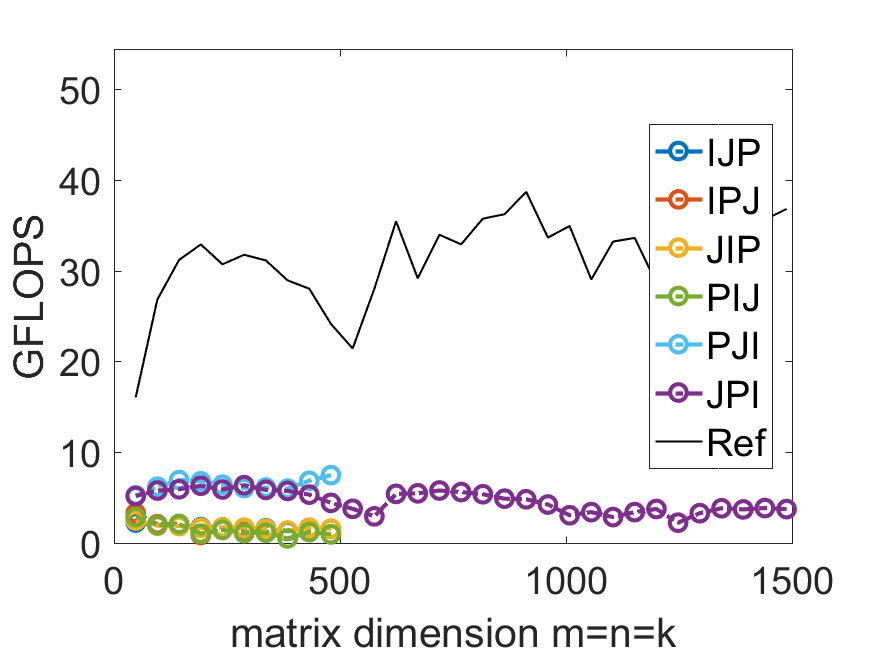

接下来的内容思想都是基于矩阵分块的方法进行处理的，也就是将大矩阵$A,B,C$进行分块变成更小的子矩阵，然后在子矩阵的基础上利用上文的某一种循环排序方法进行计算。

### 基础思想

我们将大矩阵$A,B,C$分别分成如下的矩阵块：


$$
\begin{equation}
\left(\begin{array}{cccc}
C_{0,0} & C_{0,1} & \cdots & C_{0, N-1} \\
C_{1,0} & C_{1,1} & \cdots & C_{1, N-1} \\
\vdots & \vdots & & \vdots \\
C_{M-1,0} & C_{M-1,1} & \cdots & C_{M-1, N-1}
\end{array}\right),
\left(\begin{array}{cccc}
A_{0,0} & A_{0,1} & \cdots & A_{0, K-1} \\
A_{1,0} & A_{1,1} & \cdots & A_{1, K-1} \\
\vdots & \vdots & & \vdots \\
A_{M-1,0} & A_{M-1,1} & \cdots & A_{M-1, K-1}
\end{array}\right),
\left(\begin{array}{cccc}
B_{0,0} & B_{0,1} & \cdots & B_{0, N-1} \\
B_{1,0} & B_{1,1} & \cdots & B_{1, N-1} \\
\vdots & \vdots & & \vdots \\
B_{K-1,0} & B_{K-1,1} & \cdots & B_{K-1, N-1}
\end{array}\right)
\end{equation}
$$
其中 $C_{i, j}$为$m_{i} \times n_{j}$的矩阵，$A_{i, p}$为$m_{i} \times k_{p}$的矩阵，$B_{p, j}$为$k_{p} \times n_{j}$的矩阵（后面我们都假设在每一个$C_{i, j}$或者$A_{i, p}$或者$B_{p, j}$矩阵尺寸都是一致的），并且有$\sum_{i=0}^{M-1} m_{i}=m$, $\sum_{j=0}^{N-1} n_{i}=n$， $\sum_{p=0}^{K-1} k_{i}=k$，子矩阵之间的关系为：
$$
\begin{equation}
C_{i, j}:=\sum_{p=0}^{K-1} A_{i, p} B_{p, j}+C_{i, j}
\end{equation}
$$
将上述思想转化为代码，并且使用$PJI$方法计算子矩阵乘积。我们注意到分块矩阵乘积的循环排序为$JIP$，这也是有一定的好处的，下面的内容也会有所解释。

```c
#include <stdio.h>
#include <stdlib.h>

#define alpha( i,j ) A[ (j)*ldA + (i) ]   // map alpha( i,j ) to array A
#define beta( i,j )  B[ (j)*ldB + (i) ]   // map beta( i,j ) to array B
#define gamma( i,j ) C[ (j)*ldC + (i) ]   // map gamma( i,j ) to array C

#define min( x, y ) ( (x) < (y) ? (x) : (y) )

#define MB 4							//size of submatrix C_{i,j}, A_{i,p}
#define NB 4							//size of submatrix C_{i,j}, B_{p,j}
#define KB 4							//size of submatrix A_{i,p}, B_{p,j}

void Gemm_PJI( int, int, int, double *, int, double *, int, double *, int );

void MyGemm( int m, int n, int k, double *A, int ldA,
	     double *B, int ldB, double *C, int ldC )
{
  for ( int j=0; j<n; j+=NB ){
    int jb = min( n-j, NB );    /* Size for "fringe" block */ 
    for ( int i=0; i<m; i+=MB ){
      int ib = min( m-i, MB );    /* Size for "fringe" block */ 
      for ( int p=0; p<k; p+=KB ){ 
        int pb = min( k-p, KB );    /* Size for "fringe" block */ 
        Gemm_PJI( ib, jb, pb, &alpha( i,p ), ldA, &beta( p,j ), ldB,
		                   &gamma( i,j ), ldC );
      }
    }
  }
}

void Gemm_PJI( int m, int n, int k, double *A, int ldA, 
		    double *B, int ldB,  double *C, int ldC )
{
  for ( int p=0; p<k; p++ )
    for ( int j=0; j<n; j++ )
      for ( int i=0; i<m; i++ )
        gamma( i,j ) += alpha( i,p ) * beta( p,j );
}
```

下图就是上面代码执行的结果，图中表现的结果是令人失望的：运行的效率比之前$JPI$效率还要低。此处是有一定的改进空间的。

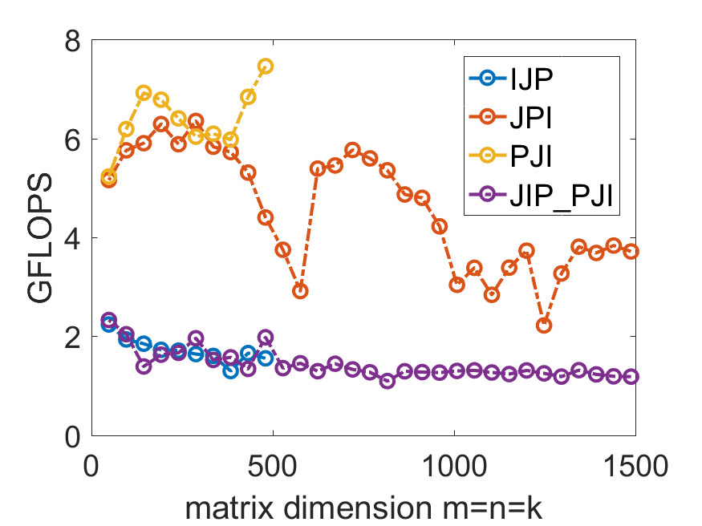

我们将代码中的`MB,NB,KB`改成如下的值，也就是增加分块矩阵的大小：

```c
#define MB 100
#define NB 100
#define KB 100
```

可以发现这样的提高是有效果的，但是效率仍然不佳。后面我们会了解这机理，更近一步利用这样的性质，提升算法性能。

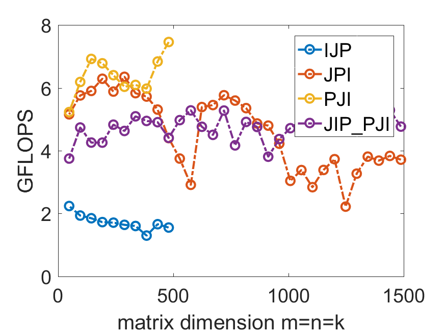

### 从内存与寄存器的角度优化算法

学习高性能计算是为了是程序算法更加的高效，这就会不可避免会接触到计算机底层知识，利用底层计算机知识提升算法效率。下面我们将介绍内存与寄存器的简单模型，并利用它分析目前算法的花销。任何计算都需要在寄存器中进行，所以任何数据需要从读取到寄存器中才可以进行计算；寄存器物理存储空间很小，所以计算出来的内容需要再次存储到内存中去。接下来是一些假设：

+ 计算机的核心只有一个。
+ 这个核心只有两个等级的存储设备：寄存器与内存。
+ 每一个双精度浮点数在内存与寄存器之间的传输需要$\beta_{R\leftrightarrow M}$时间。
+ 寄存器能够存储64个双精度浮点数。
+ 寄存器内的计算与数据移动不能同时发生。
+ 寄存器内进行一次浮点计算需要$\gamma_R$的时间。

有了上面的模型假设，接下来我们计算循环排序为$JIP$的分块矩阵乘法开销：

$$
\begin{aligned}
&\text { for } j:=0, \ldots, N-1 \\
&\text { for } i:=0, \ldots, M-1 \\
&\text { for } p:=0, \ldots, K-1 \\
&\quad \text { Load } C_{i, j}, A_{i, p}, \text { and } B_{p, j} \text { into registers } \\
&\quad C_{i, j}:=A_{i, p} B_{p, j}+C_{i, j} \\
&\quad \text { Store } C_{i, j} \text { to memory } \\
&\text { end } \\
&\text { end } \\
&\text { end }
\end{aligned}
$$

+ 我们需要存储三个矩阵，也就是需要存储$m_R\times n_R+m_R\times k_R+k_R\times n_R$个双精度浮点数到寄存器（第一项为$C_{i, j}$需要的空间，第二项为$A_{i, p}$需要的空间，第三项为$B_{p, j}$需要的空间），如果$m_R=n_R=k_R=4$，那么也就是48个浮点数（记住我们假设寄存器能够存储64个双精度浮点数）。
+ 内存我们假设$M=m/m_{R}, N=n/n_{R}$和$K=k/k_{R}$，其中$m,n,k$为矩阵的形状，$m_R,n_R,k_R$为子矩阵的元素个数，$M,N,K$为分块以后的矩阵形状（目前在分析矩阵乘法开销时假设$m,n,k$可以被$m_R,n_R,k_R$整除）。
+ 计算开销是$2mnk\gamma_R$，这是因为矩阵乘法的本质，不可能改变。
+ 数据在内存与寄存器之间移动的花销：矩阵$A_{i,p},B_{p,j},C_{i,j}$都需要读取，并且$C_{i,j}$还需要写入，所以读取和写入总花销为$MNKm_Rn_Rk_R(\frac{2}{k_R}+\frac{1}{n_R}+\frac{1}{m_R})\beta_{R\leftrightarrow M}$。

但是注意到由于最内层的循环下标为$p$，这使得读取与写入矩阵$C_{i,j}$不是没有个内层循环都需要做的，于是在这样的循环排序下真实的花销为：$$2mnk\gamma_R+[2mn+mnk(\frac{1}{n_R}+\frac{1}{m_R})]\beta_{R\leftrightarrow M}$$。计算中$k$的值一般很大，这就使得中括号里第一项是相对较小的，这就是我们选择$p$为循环最内层的原因。

$$
\begin{aligned}
&\text { for } i:=0, \ldots, M-1 \\
&\text { for } j:=0, \ldots, N-1 \\
&\quad \text { Load } C_{i, j} \text { into registers } \\
&\quad \text { for } p:=0, \ldots, K-1 \\
&\quad \text { Load } A_{i, p}, \text { and } B_{p, j} \text { into registers } \\
&\quad C_{i, j}:=A_{i, p} B_{p, j}+C_{i, j} \\
&\quad \text { end } \\
&\quad \text { Store } C_{i, j} \text { to memory } \\
&\text { end } \\
&\text { end }
\end{aligned}
$$
不难发现$n_R,m_R$尽可能的大，（但是此时也需要更大的子矩阵$C_{i,j}$，注意我们讨论的寄存器大小只有64个双精度浮点数的空间）数据读写花销更小。但是目前这不是我们优化的最主要目标。我们现在优先考虑的是：在固定$n_R,m_R$下如何优化并减小为了存储矩阵$A,B$的内容而产生的寄存器空间消耗。下面的内容中，寄存器空间消耗会从$m_R\times n_R+m_R\times k_R+k_R\times n_R$变成$m_R\times n_R+m_R+n_R$，然后再在此基础上再考虑加大$n_R,m_R$。如果我们选择$n_R=m_R=4$，那么寄存器空间占用将从48变为24个双精度浮点数，需要的空间减半了！

### 利用秩一更新减小寄存器消耗

在这一块的内容中我们将利用秩一更新计算子矩阵来减小寄存器在存储矩阵$A,B$内容时的空间占用。在计算橙色子矩阵的时有如下的过程，首先采用秩一更新来计算两个子矩阵的乘积，然后是将所得的矩阵累加到寄存器中去，最后是移动需要计算的子矩阵再次重复上述过程直到计算完成。上面的文字表达了，再在算橙色子矩阵时需要占用的寄存器空间如下：第一，计算与保存橙色子矩阵需要$m_R\times n_R$个双精度浮点数的寄存器占用；第二，采用秩一更新计算两个子矩阵乘积需要的寄存器双精度浮点数占用。第二个占用目前的值为$m_R\times k_R+k_R\times n_R$，但是秩一更新方法的使用会使得其变为$m_R+n_R$。

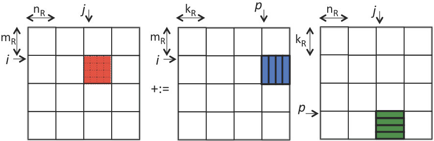

秩一更新计算蓝色子矩阵与绿色子矩阵的乘积计算方法如下图，也就是将蓝色子矩阵的列与绿色子矩阵的对应行进行多次秩一更新（秩一更新利用了axpy运算）。这里的叙述不难发现，我们其实可以只存储蓝色矩阵的某一列与绿色矩阵对应的行到寄存器中去，计算完成后再将下一次计算需要的行与列存储到寄存器中即可。于是每一次寄存器中存储的矩阵$A,B$的内容只有目前参与运算的行与列，也就是$m_R+n_R$个双精度浮点数。


计算完上面的内容后只需要将所得矩阵累加，再移动到下一个子矩阵，最后再次利用秩一更新计算子矩阵乘积即可。综上所述，整个流程中每一个小循环只需要存储$m_R\times n_R+m_R+n_R$个双精度浮点数。

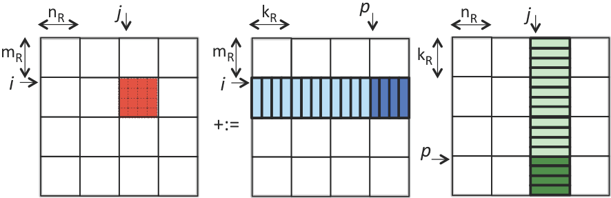

其实上文中的矩阵分块方法可以简化一下，上文中矩阵$A$被列分块、矩阵$B$被行分块，其实这样完全是不必要的。我们完全可以只将矩阵$A$分为行条，矩阵$B$分为列条，也就是如下图所示的分块方法。

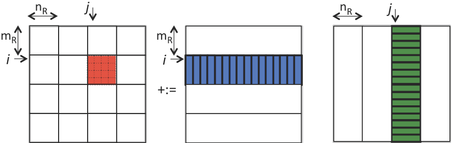

橙色子矩阵等于蓝色行条乘以绿色列条。然后进行多次矩阵行条与列条的秩一更新。

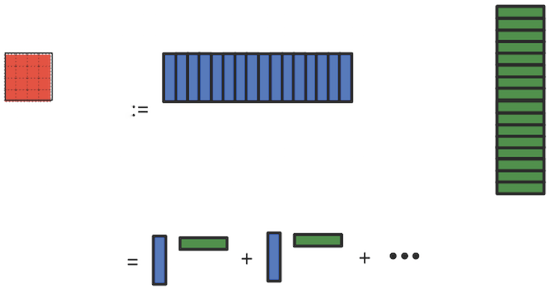

将这一部分的内容转化为代码如下：

```c
#include <stdio.h>
#include <stdlib.h>

#define alpha( i,j ) A[ (j)*ldA + (i) ]   // map alpha( i,j ) to array A
#define beta( i,j )  B[ (j)*ldB + (i) ]   // map beta( i,j ) to array B
#define gamma( i,j ) C[ (j)*ldC + (i) ]   // map gamma( i,j ) to array C

#define min( x, y ) ( (x) < (y) ? (x) : (y) )

#define MB 4
#define NB 4
#define KB 4

void Gemm_P_Ger( int, int, int, double *, int, double *, int, double *, int );
void Ger( int, int, double *, int, double *, int, double *, int );

void MyGemm( int m, int n, int k, double *A, int ldA,
	     double *B, int ldB, double *C, int ldC )
{
  for ( int j=0; j<n; j+=NB ){
    int jb = min( n-j, NB );    /* Size for "finge" block */ 
    for ( int i=0; i<m; i+=MB ){
      int ib = min( m-i, MB );    /* Size for "finge" block */ 
      Gemm_P_Ger( ib, jb, k, &alpha( i,0 ), ldA, &beta( 0,j ), ldB,
		           &gamma( i,j ), ldC );
    }
  }
}

void Gemm_P_Ger( int m, int n, int k, double *A, int ldA, 
		 double *B, int ldB,  double *C, int ldC )
{
  for ( int p=0; p<k; p++ )
    Ger( m, n, &alpha( 0,p ), 1, &beta( p,0 ), ldB, C, ldC );
}
```

注意到`MyGemm`函数中并没有$p$循环，这是应为矩阵$A$没有被列分块也就是矩阵$B$没有被行分块。函数`Gemm_P_Ger`就是计算橙色子矩阵，其中调用的`Ger`是利用axpy运算的秩一更新。注意到代码中没有限制`MB,NB,KB`为`m,n,k`的倍数。

### 向量寄存器在矩阵乘法中的作用

上文是固定$n_R,m_R$，优化并减小为了存储矩阵$A,B$的内容而产生的寄存器空间消耗。这一部分的内容是利用向量寄存器提升计算效率，并且适当探讨提升$n_R,m_R$的效果。我们考虑的架构为256位的向量寄存器，也就是向量寄存器只能容纳下4个双精度浮点数，考虑到我们寄存器大小为64个双精度浮点数，这也就意味着向量寄存器只能有16个。和上文不同，由于使用向量寄存器的原因，注意这里的矩阵$C$的尺寸被严格限制了，$m,n$必须分别为$m_R,n_R$的倍数！目前我们也只考虑固定$n_R=m_R=4$的情况，介绍向量寄存器的基础知识与AVX2向量指令。SIMD指的是Single-Instruction, Multiple Data，也就是不同数据同一操作，这就是指令级并行。我们注意到在进行axpy运算时，每一个向量元素都是相同的运算，这就满足不同数据同一操作的情况。下面的表达式就是在计算橙色子矩阵时的情况，化简到最后我们发现，底层都是axpy运算：
$$
\begin{aligned}
&\left(\begin{array}{cccc}
\gamma_{0,0} & \gamma_{0,1} & \gamma_{0,2} & \gamma_{0,3} \\
\gamma_{1,0} & \gamma_{1,1} & \gamma_{1,2} & \gamma_{1,3} \\
\gamma_{2,0} & \gamma_{2,1} & \gamma_{2,2} & \gamma_{2,3} \\
\gamma_{3,0} & \gamma_{3,1} & \gamma_{3,2} & \gamma_{3,3}
\end{array}\right)+:=\left(\begin{array}{c}
\alpha_{0, p} \\
\alpha_{1, p} \\
\alpha_{2, p} \\
\alpha_{3, p}
\end{array}\right)\left(\begin{array}{llll}
\beta_{p, 0} & \beta_{p, 1} & \beta_{p, 2} & \beta_{p, 3}
\end{array}\right) \\
&=\beta_{p, 0}\left(\begin{array}{l}
\alpha_{0, p} \\
\alpha_{1, p} \\
\alpha_{2, p} \\
\alpha_{3, p}
\end{array}\right)+\beta_{p, 1}\left(\begin{array}{c}
\alpha_{0, p} \\
\alpha_{1, p} \\
\alpha_{2, p} \\
\alpha_{3, p}
\end{array}\right)+\beta_{p, 2}\left(\begin{array}{c}
\alpha_{0, p} \\
\alpha_{1, p} \\
\alpha_{2, p} \\
\alpha_{3, p}
\end{array}\right)+\beta_{p, 3}\left(\begin{array}{c}
\alpha_{0, p} \\
\alpha_{1, p} \\
\alpha_{2, p} \\
\alpha_{3, p}
\end{array}\right)
\end{aligned}
$$
axpy运算更底层的是FMA，而现代的计算核心都可以利用小型向量同时对不同的数据同时进行FMA运算，如下的表达式所示。
$$
\begin{array}{ccccc}
\gamma_{0,0} & +:= & \alpha_{0, p} & \times & \beta_{p, 0} \\
\gamma_{1,0} & +:= & \alpha_{1, p} & \times & \beta_{p, 0} \\
\gamma_{2,0} & +:= & \alpha_{2, p} & \times & \beta_{p, 0} \\
\gamma_{3,0} & +:= & \alpha_{3, p} & \times & \beta_{p, 0}
\end{array}
$$
将上面的表达式合并一下，计算橙色子矩阵的伪代码就有如下：
$$
\begin{aligned}
&\text { for } p=0, \ldots, k-1 \\
&\left( \begin{array}{c|c|c|c}
\gamma_{0,0}+:=\alpha_{0, p} \times \beta_{p, 0} & \gamma_{0,1}+:=\alpha_{0, p} \times \beta_{p, 1} & \gamma_{0,2}+:=\alpha_{0, p} \times \beta_{p, 2} & \gamma_{0,3}+:=\alpha_{0, p} \times \beta_{p, 3} \\
\gamma_{1,0}+:=\alpha_{1, p} \times \beta_{p, 0} & \gamma_{1,1}+:=\alpha_{1, p} \times \beta_{p, 1} & \gamma_{1,2}+:=\alpha_{1, p} \times \beta_{p, 2} & \gamma_{1,3}+:=\alpha_{1, p} \times \beta_{p, 3} \\
\gamma_{2,0}+:=\alpha_{2, p} \times \beta_{p, 0} & \gamma_{2,1}+:=\alpha_{2, p} \times \beta_{p, 1} & \gamma_{2,2}+:=\alpha_{2, p} \times \beta_{p, 2} & \gamma_{2,3}+:=\alpha_{2, p} \times \beta_{p, 3} \\
\gamma_{3,0}+:=\alpha_{3, p} \times \beta_{p, 0} & \gamma_{3,1}+:=\alpha_{3, p} \times \beta_{p, 1} & \gamma_{3,2}+:=\alpha_{3, p} \times \beta_{p, 2} & \gamma_{3,3}+:=\alpha_{3, p} \times \beta_{p, 3}
\end{array}\right) \\
&\text { end }
\end{aligned}
$$
结合下图就可以较为轻易的阅读理解清楚下面Intel Intrinsic Instruction代码：

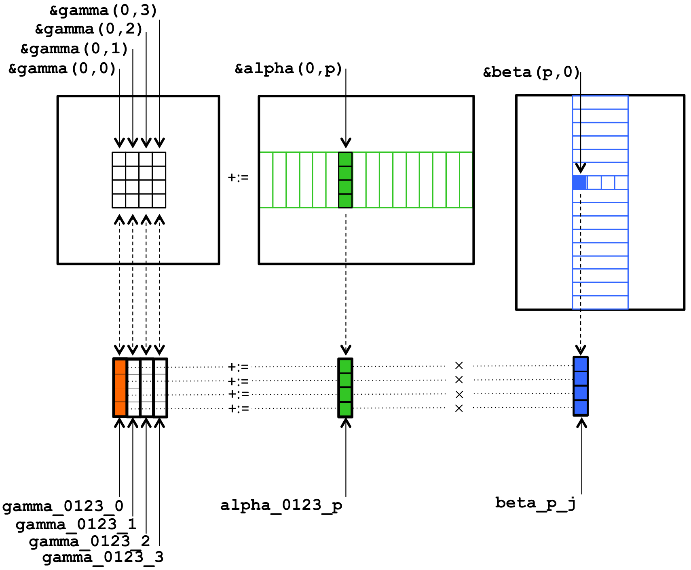

```c
#define alpha( i,j ) A[ (j)*ldA + (i) ]   // map alpha( i,j ) to array A
#define beta( i,j )  B[ (j)*ldB + (i) ]   // map beta( i,j ) to array B
#define gamma( i,j ) C[ (j)*ldC + (i) ]   // map gamma( i,j ) to array C

#include<immintrin.h>

void Gemm_MRxNRKernel( int k, double *A, int ldA, double *B, int ldB, double *C, int ldC );

void MyGemm( int m, int n, int k, double *A, int ldA, 
		  double *B, int ldB, double *C, int ldC ) 
{
  if ( m % MR != 0 || n % NR != 0 ){
    printf( "m and n must be multiples of MR and NR, respectively \n" ); 
    exit( 0 ); 
  }
  
  for ( int j=0; j<n; j+=NR ) /* n is assumed to be a multiple of NR */
    for ( int i=0; i<m; i+=MR ) /* m is assumed to be a multiple of MR */
      Gemm_MRxNRKernel( k, &alpha( i,0 ), ldA, &beta( 0,j ), ldB, &gamma( i,j ), ldC ); 
}

void Gemm_MRxNRKernel( int k, double *A, int ldA, double *B, int ldB,
		double *C, int ldC )
{
  /* Declare vector registers to hold 4x4 C and load them */
  __m256d gamma_0123_0 = _mm256_loadu_pd( &gamma( 0,0 ) );
  __m256d gamma_0123_1 = _mm256_loadu_pd( &gamma( 0,1 ) );
  __m256d gamma_0123_2 = _mm256_loadu_pd( &gamma( 0,2 ) );
  __m256d gamma_0123_3 = _mm256_loadu_pd( &gamma( 0,3 ) );
   	
  for ( int p=0; p<k; p++ ){
    /* Declare vector register for load/broadcasting beta( p,j ) */
    __m256d beta_p_j;
    
    /* Declare a vector register to hold the current column of A and load
       it with the four elements of that column. */
    __m256d alpha_0123_p = _mm256_loadu_pd( &alpha( 0,p ) );

    /* Load/broadcast beta( p,0 ). */
    beta_p_j = _mm256_broadcast_sd( &beta( p, 0) );
    
    /* update the first column of C with the current column of A times
       beta ( p,0 ) */
    gamma_0123_0 = _mm256_fmadd_pd( alpha_0123_p, beta_p_j, gamma_0123_0 );
    
    /* REPEAT for second, third, and fourth columns of C.  Notice that the 
       current column of A needs not be reloaded. */

    /* Load/broadcast beta( p,1 ). */
    beta_p_j = _mm256_broadcast_sd( &beta( p, 1) );
    
    /* update the second column of C with the current column of A times
       beta ( p,1 ) */
    gamma_0123_1 = _mm256_fmadd_pd( alpha_0123_p, beta_p_j, gamma_0123_1 );

    /* Load/broadcast beta( p,2 ). */
    beta_p_j = _mm256_broadcast_sd( &beta( p, 2) );
    
    /* update the third column of C with the current column of A times
       beta ( p,2 ) */
    gamma_0123_2 = _mm256_fmadd_pd( alpha_0123_p, beta_p_j, gamma_0123_2 );

    /* Load/broadcast beta( p,3 ). */
    beta_p_j = _mm256_broadcast_sd( &beta( p, 3) );
    
    /* update the fourth column of C with the current column of A times
       beta ( p,3 ) */
    gamma_0123_3 = _mm256_fmadd_pd( alpha_0123_p, beta_p_j, gamma_0123_3 );
  }
  
  /* Store the updated results */
  _mm256_storeu_pd( &gamma(0,0), gamma_0123_0 );
  _mm256_storeu_pd( &gamma(0,1), gamma_0123_1 );
  _mm256_storeu_pd( &gamma(0,2), gamma_0123_2 );
  _mm256_storeu_pd( &gamma(0,3), gamma_0123_3 );
}
```

注意到函数`MyGemm`中`MR,NR`等于$m_R,n_R$，目前都等于4（目前`MR,NR`的代码都是又臭又长，后面改变`MR,NR`代码量可想而知）。接下来我们将重心放在改变$m_R,n_R$上，查看这样的改变会对效率有怎样的影响。注意到我们向量寄存器长度只有4个双精度浮点数！例如，当考虑$m_R=8,n_R=4$时，也就是橙色子矩阵具有8行4列，此时需要8个向量寄存器存储橙色子矩阵（第$2i-1$个向量寄存器存储第$i$列的前四个元素，第$2i$个存储第$i$列的后四个元素，而一共有4列，所以一共需要8个向量寄存器存储橙色子矩阵），需要2个向量寄存器存储目前参与计算的矩阵$A$子矩阵的某一列（同样的第一个存储此列的前四个元素，第二个存储此列的后四个元素），最后还需要1个向量寄存器存储目前参与计算的矩阵$B$矩阵的某一个元素（复杂3份然后放到同一个向量寄存器中），这样一共需要11个向量寄存器。将$m_R=8,n_R=4$转化为代码如下：

```c
#define alpha( i,j ) A[ (j)*ldA + (i) ]   // map alpha( i,j ) to array A
#define beta( i,j )  B[ (j)*ldB + (i) ]   // map beta( i,j ) to array B
#define gamma( i,j ) C[ (j)*ldC + (i) ]   // map gamma( i,j ) to array C

#include<immintrin.h>

void Gemm_MRxNRKernel( int k, double *A, int ldA, double *B, int ldB,
		double *C, int ldC )
{
  /* Declare vector registers to hold 8x4 C and load them */
  __m256d gamma_0123_0 = _mm256_loadu_pd( &gamma( 0,0 ) );
  __m256d gamma_0123_1 = _mm256_loadu_pd( &gamma( 0,1 ) );
  __m256d gamma_0123_2 = _mm256_loadu_pd( &gamma( 0,2 ) );
  __m256d gamma_0123_3 = _mm256_loadu_pd( &gamma( 0,3 ) );
  __m256d gamma_4567_0 = _mm256_loadu_pd( &gamma( 4,0 ) );
  __m256d gamma_4567_1 = _mm256_loadu_pd( &gamma( 4,1 ) );
  __m256d gamma_4567_2 = _mm256_loadu_pd( &gamma( 4,2 ) );
  __m256d gamma_4567_3 = _mm256_loadu_pd( &gamma( 4,3 ) );
   	
  for ( int p=0; p<k; p++ ){
    /* Declare vector register for load/broadcasting beta( p,j ) */
    __m256d beta_p_j;
    
    /* Declare vector registersx to hold the current column of A and load
       them with the eight elements of that column. */
    __m256d alpha_0123_p = _mm256_loadu_pd( &alpha( 0,p ) );
    __m256d alpha_4567_p = _mm256_loadu_pd( &alpha( 4,p ) );

    /* Load/broadcast beta( p,0 ). */
    beta_p_j = _mm256_broadcast_sd( &beta( p, 0) );
    
    /* update the first column of C with the current column of A times
       beta ( p,0 ) */
    gamma_0123_0 = _mm256_fmadd_pd( alpha_0123_p, beta_p_j, gamma_0123_0 );
    gamma_4567_0 = _mm256_fmadd_pd( alpha_4567_p, beta_p_j, gamma_4567_0 );
    
    /* REPEAT for second, third, and fourth columns of C.  Notice that the 
       current column of A needs not be reloaded. */

    /* Load/broadcast beta( p,1 ). */
    beta_p_j = _mm256_broadcast_sd( &beta( p, 1) );
    
    /* update the second column of C with the current column of A times
       beta ( p,1 ) */
    gamma_0123_1 = _mm256_fmadd_pd( alpha_0123_p, beta_p_j, gamma_0123_1 );
    gamma_4567_1 = _mm256_fmadd_pd( alpha_4567_p, beta_p_j, gamma_4567_1 );

    /* Load/broadcast beta( p,2 ). */
    beta_p_j = _mm256_broadcast_sd( &beta( p, 2) );
    
    /* update the third column of C with the current column of A times
       beta ( p,2 ) */
    gamma_0123_2 = _mm256_fmadd_pd( alpha_0123_p, beta_p_j, gamma_0123_2 );
    gamma_4567_2 = _mm256_fmadd_pd( alpha_4567_p, beta_p_j, gamma_4567_2 );

    /* Load/broadcast beta( p,3 ). */
    beta_p_j = _mm256_broadcast_sd( &beta( p, 3) );
    
    /* update the fourth column of C with the current column of A times
       beta ( p,3 ) */
    gamma_0123_3 = _mm256_fmadd_pd( alpha_0123_p, beta_p_j, gamma_0123_3 );
    gamma_4567_3 = _mm256_fmadd_pd( alpha_4567_p, beta_p_j, gamma_4567_3 );
  }
  
  /* Store the updated results */
  _mm256_storeu_pd( &gamma(0,0), gamma_0123_0 );
  _mm256_storeu_pd( &gamma(0,1), gamma_0123_1 );
  _mm256_storeu_pd( &gamma(0,2), gamma_0123_2 );
  _mm256_storeu_pd( &gamma(0,3), gamma_0123_3 );
  _mm256_storeu_pd( &gamma(4,0), gamma_4567_0 );
  _mm256_storeu_pd( &gamma(4,1), gamma_4567_1 );
  _mm256_storeu_pd( &gamma(4,2), gamma_4567_2 );
  _mm256_storeu_pd( &gamma(4,3), gamma_4567_3 );
}
```

下面的图片是不同的$m_R,n_R$的运算效率。

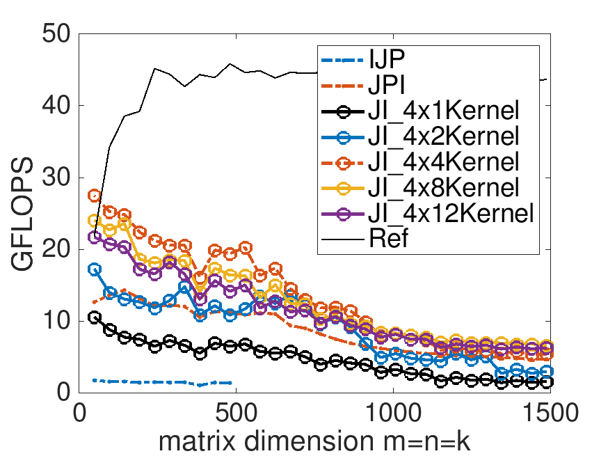

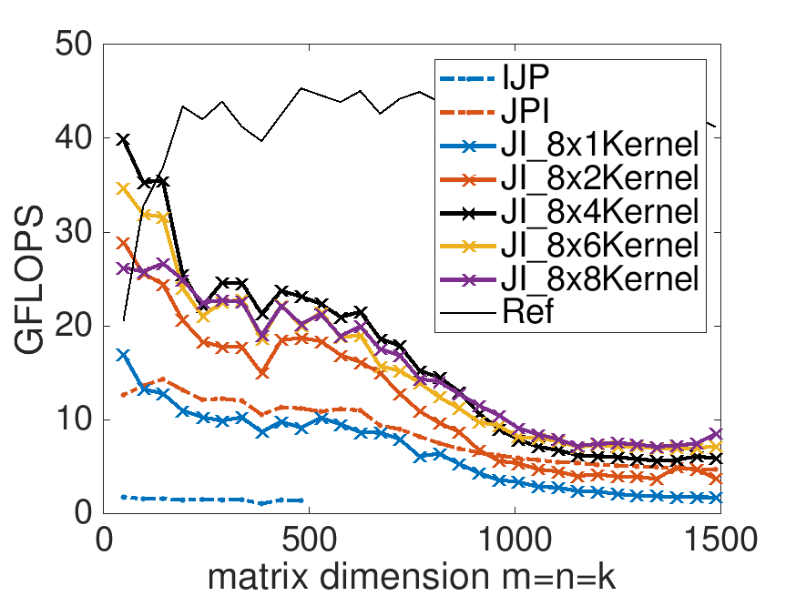

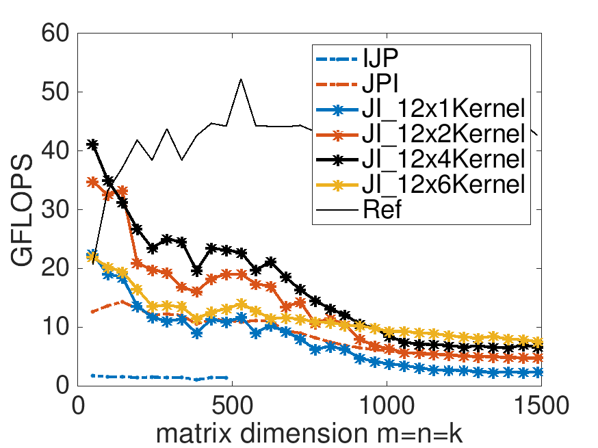

从上面图片来看，在相同的$m_R$下效率最高的为$(4,4),(8,4),(12,4)$，其向量寄存器消耗分别为：6，11，16。我们定义
$$
\frac{2mnk}{2mn+mnk(1/n_R+1/m_R)}
$$
浮点运算与内存操作的比值（前文中浮点运算耗时$2mnk\gamma_R$，内存读写耗时$[2mn+mnk(\frac{1}{n_R}+\frac{1}{m_R})]\beta_{R\leftrightarrow M}$），显然我们希望内存操作越小越好，也就是这个比值越大越好。（注意现实中$k$一般较大，所以分母的第一项一般被忽略）。$(4,4),(8,4),(12,4)$他们的浮点运算与内存操作的比值为4，5.33，6。图中清晰地表达了在较小维度的矩阵上，我们已经能够与Ref相媲美的，但是高维度矩阵还需要优化。